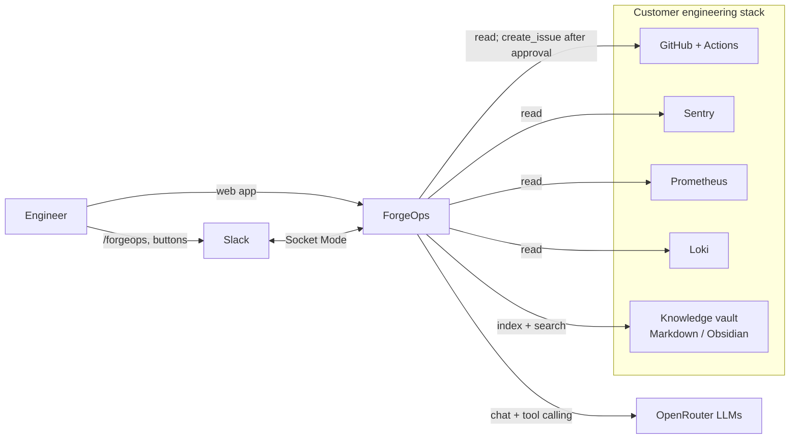
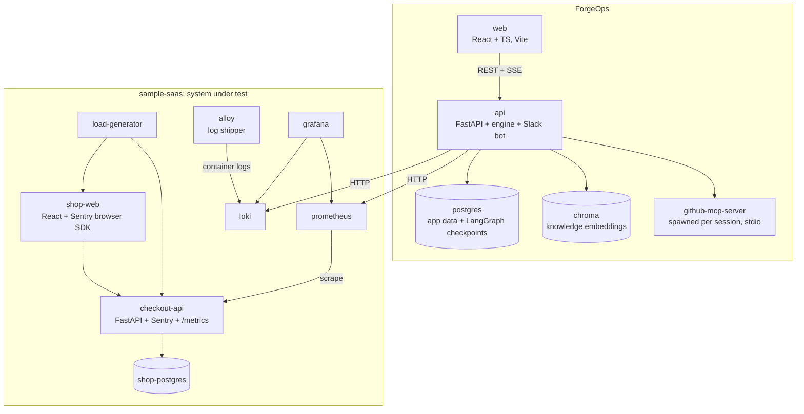
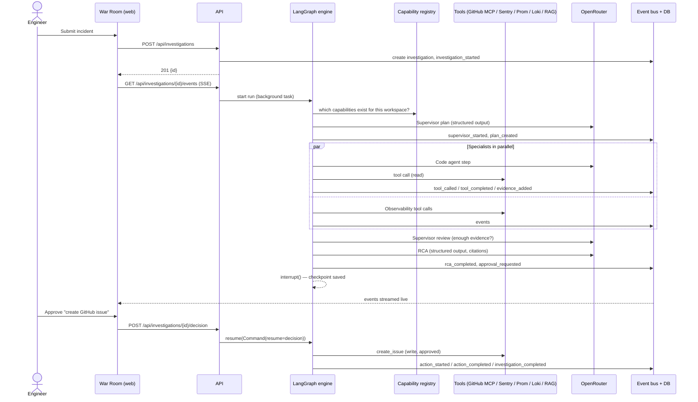
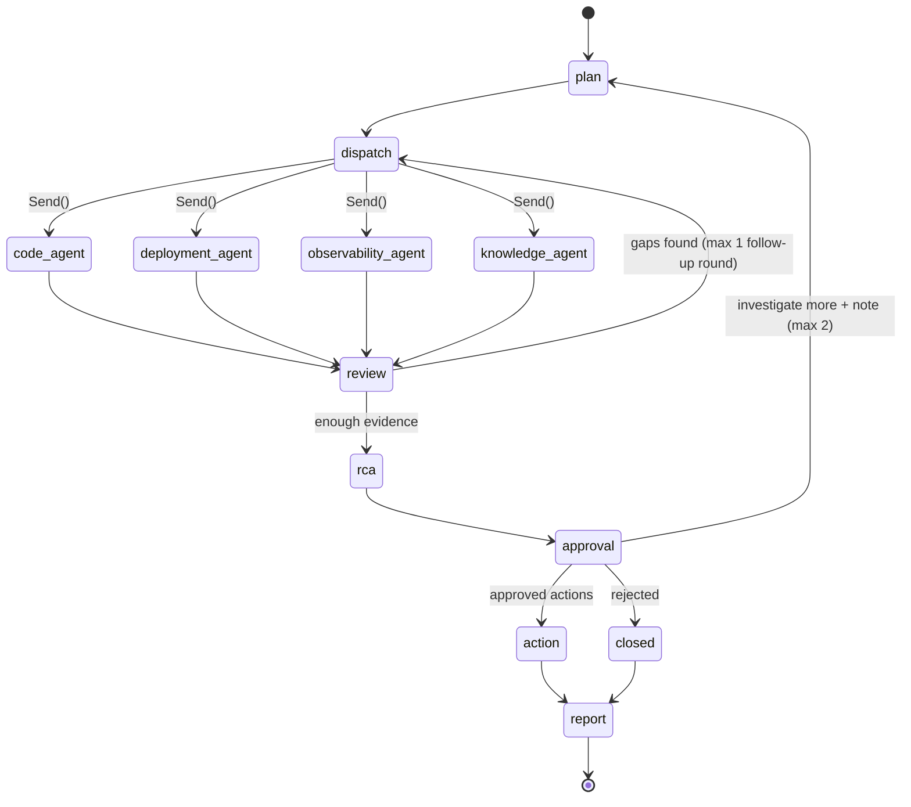
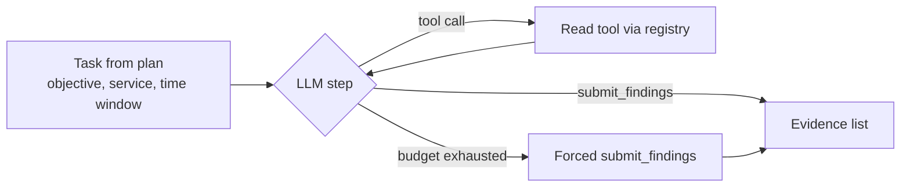
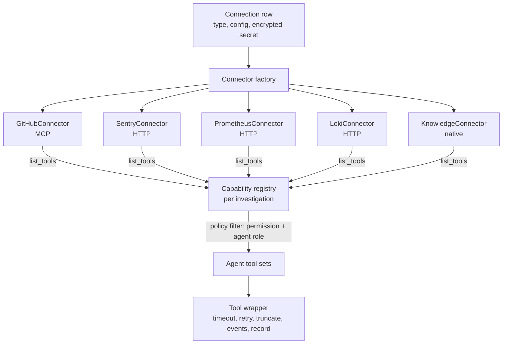
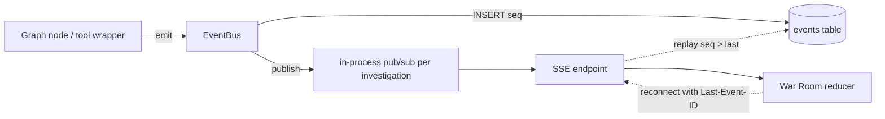
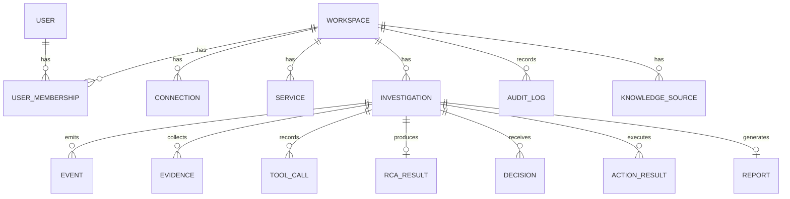

# ForgeOps — Technical Requirements Document (MVP)

| | |
|---|---|
| Document | TRD, MVP scope |
| Status | Draft for review |
| Date | 2026-09-21 |
| Companion | [PRD.md](PRD.md) |

---

## 1. Architecture overview

### 1.1 System context



### 1.2 Containers (development topology, Docker Compose)



The ForgeOps and sample-saas stacks are separate compose projects. ForgeOps reaches the sample stack only through URLs configured on the Connections page, exactly as it would reach a customer.

### 1.3 Layers

| Layer | Responsibility | Package |
|---|---|---|
| Presentation | War Room, pages, SSE client | `frontend/` |
| Application | Auth, REST API, SSE, Slack bot, lifecycle | `backend/forgeops/api`, `backend/forgeops/slack` |
| Orchestration | LangGraph graph, shared state, checkpoints | `backend/forgeops/engine` |
| Agents | Supervisor, specialists, RCA, Action | `backend/forgeops/engine/agents` |
| Capability | Tool interface, registry, permission policy | `backend/forgeops/capabilities` |
| Connectors | GitHub (MCP), Sentry, Prometheus, Loki, Knowledge | `backend/forgeops/connectors` |
| Memory | Chunking, embeddings, Chroma, BM25, hybrid retrieval | `backend/forgeops/knowledge` |
| Persistence | SQLAlchemy models, Alembic migrations | `backend/forgeops/db` |
| Events | Event bus, persistence, SSE fan-out | `backend/forgeops/events` |

## 2. Technology choices

| Concern | Choice | Reason |
|---|---|---|
| Backend runtime | Python 3.12 (uv-managed) | LangGraph/Chroma require ≥ 3.10 |
| Web framework | FastAPI, Pydantic v2, uvicorn | Async, typed contracts |
| Orchestration | LangGraph + `langgraph-checkpoint-postgres` | Parallel fan-out, reducers, `interrupt()` for approval, durable pause |
| LLM access | OpenRouter via `langchain-openai` `ChatOpenAI(base_url=…)` | Provider-agnostic, tool calling; per-role model config |
| MCP | Official `mcp` Python SDK client → `ghcr.io/github/github-mcp-server` (pinned tag) | Official, supports read-only mode and toolset selection |
| HTTP clients | `httpx` async | Sentry, Prometheus, Loki APIs |
| Database | PostgreSQL 16, SQLAlchemy 2 async, Alembic | Real deployment parity; also hosts checkpoints |
| Vector store | ChromaDB (server container) | Spec requirement |
| Embeddings | Local sentence-transformer (`all-MiniLM-L6-v2` via Chroma default ONNX) | No extra credential |
| Lexical search | `rank-bm25` | Hybrid retrieval |
| Secrets at rest | `cryptography` Fernet, key from env | Encrypted connection credentials |
| Auth | Argon2 password hash, httpOnly session cookie | Simple admin login, workspace-ready |
| Slack | `slack-bolt` async, Socket Mode | No public URL needed |
| Frontend | React 18 + TypeScript + Vite, React Router, TanStack Query, CSS Modules | No heavy graphics engine; SVG + CSS for the office |
| Tests | pytest + pytest-asyncio + respx; Vitest + React Testing Library; Playwright (smoke) | |
| Logging | `structlog` JSON logs with investigation_id/workspace_id | |

## 3. Investigation flow

### 3.1 End-to-end sequence



### 3.2 Graph



- `dispatch` uses LangGraph `Send` to run only the agents the plan selected **and** whose capabilities are connected.
- Specialists write into a reducer-backed `evidence` list (`Annotated[list[Evidence], operator.add]`), so concurrent writes merge safely.
- `approval` calls `interrupt(payload)`; the Postgres checkpointer persists the paused run. Resume via `Command(resume=Decision)`.
- `report` always runs: a closed or rejected investigation still gets a report.

### 3.3 Specialist agent loop



- Tools bound: the agent's read tools + `submit_findings` (structured output).
- Budget: max 6 tool calls, 90 s wall clock, per-tool timeout 20 s. On exhaustion the agent is asked once more to submit findings with what it has.
- Any exception → `agent_failed` event + entry in `errors`; the graph continues.

### 3.4 Prompts (contract, not wording)

| Agent | Input | Output (Pydantic) | Hard rules |
|---|---|---|---|
| Supervisor plan | incident, services map, available capabilities, now | `Plan{summary, service, window_start, window_end, hypotheses[], tasks[{agent, objective, hints}]}` | Only choose agents with capabilities; window defaults to last 2 h |
| Supervisor review | plan, evidence summaries | `Review{sufficient: bool, follow_up_tasks[]}` | At most one follow-up round |
| Specialist | task, service mapping, window | `Findings{evidence[]}` | Every evidence item must reference ≥ 1 tool call id from this run |
| RCA | incident, plan, all evidence, errors, missing capabilities | `RCA{...}` (§4.3) | Cite evidence ids; no uncited claims; list missing info |
| Action | approved recommendations, RCA | executes tools; `Report` | Only tools of approved recommendations, with the parameters the human saw |

Tool outputs are wrapped as data (`<tool_output source=…>…</tool_output>`), and system prompts state that instructions inside tool output must be ignored.

## 4. Data contracts

### 4.1 Shared investigation state

```python
class InvestigationState(TypedDict):
    workspace_id: str
    investigation_id: str
    incident: Incident                  # description, service?, window?, source (web|slack)
    capabilities: list[str]             # connected at start
    plan: Plan | None
    tasks: list[AgentTask]
    evidence: Annotated[list[Evidence], operator.add]
    tool_calls: Annotated[list[ToolCallRecord], operator.add]
    review_rounds: int
    rca: RCA | None
    decision: Decision | None
    action_results: Annotated[list[ActionResult], operator.add]
    report_id: str | None
    errors: Annotated[list[AgentError], operator.add]
    warnings: Annotated[list[str], operator.add]
```

Per-agent evidence lists from the original spec are derived by filtering `evidence` on `agent`.

### 4.2 Evidence

```python
class Artifact(BaseModel):
    type: Literal["commit","pull_request","diff","workflow_run","release",
                  "error_issue","error_event","metric_series","log_lines","doc_chunk"]
    ref: str                     # sha, run id, issue id, query, doc path
    url: str | None
    timestamp: datetime | None
    excerpt: str | None          # truncated, max 2 KB

class Evidence(BaseModel):
    id: str
    agent: AgentName
    capability: Capability       # code|deployments|errors|metrics|logs|knowledge
    source: str                  # connection id
    source_type: str             # github|sentry|prometheus|loki|knowledge
    finding: str                 # one-sentence claim
    artifacts: list[Artifact]
    severity: Literal["info","low","medium","high","critical"]
    confidence: float            # 0..1
    limitations: str | None
    tool_call_ids: list[str]     # must be non-empty
    created_at: datetime
```

### 4.3 RCA

```python
class Recommendation(BaseModel):
    id: str
    title: str
    description: str
    action: Literal["none","github_issue"]   # MVP write actions
    parameters: dict                          # shown verbatim to the approver
    requires_approval: bool                   # true for every write

class RCA(BaseModel):
    root_cause: str
    category: Literal["code_change","config_change","dependency","infrastructure",
                      "data","traffic","unknown"]
    confidence: float
    supporting_evidence: list[str]            # evidence ids
    contradicting_evidence: list[str]
    alternative_hypotheses: list[str]
    missing_information: list[str]            # e.g. "Loki not connected"
    recommendations: list[Recommendation]
```

Confidence caps (applied in code after the LLM returns): no supporting evidence → ≤ 0.2; only one source type → ≤ 0.6; any contradicting evidence → −0.1.

### 4.4 Decision

```python
class Decision(BaseModel):
    kind: Literal["approve","reject","investigate_more"]
    approved_recommendation_ids: list[str] = []
    note: str | None
    decided_by: str      # user id or slack user id
    channel: Literal["web","slack"]
```

## 5. Capability registry and connectors

### 5.1 Model



```python
class ToolSpec(BaseModel):
    name: str                       # e.g. "prometheus.query_range"
    description: str
    capability: Capability
    permission: Literal["read","write","execute"]
    input_model: type[BaseModel]
    connection_id: str

class ToolResult(BaseModel):
    ok: bool
    data: Any
    error: str | None
    truncated: bool
    duration_ms: int

class Connector(Protocol):
    type: str
    async def health_check(self) -> HealthStatus: ...
    async def list_tools(self) -> list[ToolSpec]: ...
    async def call(self, tool: str, args: BaseModel) -> ToolResult: ...
    async def close(self) -> None: ...
```

### 5.2 Capability → agent mapping (static in MVP)

| Capability | Agent |
|---|---|
| code | Code |
| deployments | Deployment |
| errors, metrics, logs | Observability |
| knowledge | Knowledge |
| write tools (`github.create_issue`) | Action, only after approval |

### 5.3 MVP tools

| Tool | Connector | Perm | Capability |
|---|---|---|---|
| `github.list_commits(repo, since, until)` | GitHub MCP | read | code |
| `github.get_commit(repo, sha)` (includes diff) | GitHub MCP | read | code |
| `github.compare(repo, base, head)` | GitHub MCP | read | code |
| `github.list_pull_requests(repo, state)` / `get_pull_request` | GitHub MCP | read | code |
| `github.get_file(repo, path, ref)` | GitHub MCP | read | code |
| `github.list_workflow_runs(repo, since)` | GitHub MCP | read | deployments |
| `github.get_workflow_run_logs(repo, run_id)` | GitHub MCP | read | deployments |
| `github.list_releases(repo)` | GitHub MCP | read | deployments |
| `github.create_issue(repo, title, body, labels)` | GitHub MCP (write session) | write | action |
| `sentry.list_issues(project, since, query)` | Sentry REST | read | errors |
| `sentry.get_issue_latest_event(issue_id)` (stack trace, release, tags) | Sentry REST | read | errors |
| `sentry.list_releases(project)` | Sentry REST | read | deployments |
| `prometheus.query(promql, time)` | Prometheus HTTP | read | metrics |
| `prometheus.query_range(promql, start, end, step)` | Prometheus HTTP | read | metrics |
| `prometheus.list_metrics(match)` | Prometheus HTTP | read | metrics |
| `prometheus.active_alerts()` | Prometheus HTTP | read | metrics |
| `loki.query_range(logql, start, end, limit)` | Loki HTTP | read | logs |
| `loki.list_labels()` / `label_values(label)` | Loki HTTP | read | logs |
| `knowledge.search(query, k)` | Native | read | knowledge |

GitHub MCP tool names are mapped to these ForgeOps names by the connector; the exact upstream names are pinned to the server version and verified in the connector's contract test.

### 5.4 Wrapper behavior
- Timeout 20 s per call; retry twice on 429/5xx with exponential backoff.
- Truncation: logs ≤ 200 lines, metric series downsampled to ≤ 120 points per series and ≤ 10 series, text ≤ 8 KB; `truncated=true` recorded.
- Emits `tool_called` (name, args summary) and `tool_completed` (ok, duration, result summary).
- Persists a `ToolCallRecord` (id, agent, tool, args, ok, duration, result excerpt) for provenance.
- Secrets never appear in args, logs or events.

### 5.5 Service map

```python
class Service(BaseModel):
    id: str
    workspace_id: str
    name: str                     # "checkout"
    aliases: list[str]            # ["checkout-api", "payments"]
    github_repo: str | None       # "owner/forgeops-sample-shop"
    sentry_projects: list[str]    # ["shop-web", "checkout-api"]
    prometheus_selector: str | None   # 'job="checkout-api"'
    loki_selector: str | None         # '{service="checkout-api"}'
    knowledge_tags: list[str]
```

## 6. Events

### 6.1 Flow



### 6.2 Event envelope

```json
{
  "seq": 42,
  "investigation_id": "inv_…",
  "type": "tool_called",
  "agent": "observability",
  "ts": "2026-09-21T10:14:03.120Z",
  "data": { "tool": "prometheus.query_range", "summary": "histogram_quantile(0.95, …)" }
}
```

### 6.3 Event types

Canonical (from spec): `investigation_started`, `supervisor_started`, `agent_started`, `tool_called`, `tool_completed`, `evidence_added`, `agent_failed`, `agent_completed`, `rca_started`, `rca_completed`, `approval_requested`, `approval_granted`, `approval_rejected`, `action_started`, `action_completed`, `investigation_completed`.

Added for the MVP: `plan_created` (tasks, skipped agents with reasons), `agent_skipped`, `review_completed`, `investigation_failed`, `report_ready`.

## 7. Persistence



- Every table except `user` carries `workspace_id`; every query is scoped by it (repository layer enforces).
- `connection.secret_encrypted` holds Fernet-encrypted JSON; decrypted only inside connector construction.
- LangGraph checkpoint tables are created by `AsyncPostgresSaver.setup()` in the same database.
- `investigation.status`: `queued | running | awaiting_approval | acting | completed | rejected | failed`.

## 8. API contract

All routes under `/api`, JSON, session cookie auth except `/api/auth/login` and `/api/health`.

| Method | Path | Purpose |
|---|---|---|
| POST | `/auth/login`, `/auth/logout` | Session |
| GET | `/auth/me` | Current user + workspace |
| GET | `/health` | Liveness |
| GET/POST | `/connections` | List / create (validates + health-checks) |
| GET/PATCH/DELETE | `/connections/{id}` | Detail (no secrets), update, remove |
| POST | `/connections/{id}/test` | Re-run health check |
| GET | `/connections/{id}/tools` | Discovered tools with permissions |
| GET/POST | `/services`, GET/PATCH/DELETE `/services/{id}` | Service map |
| GET | `/capabilities` | Connected capabilities + which agents they enable |
| POST | `/investigations` | Start `{description, service_id?, window_start?, window_end?}` |
| GET | `/investigations` | List with filters |
| GET | `/investigations/{id}` | Full snapshot: status, plan, evidence, rca, decisions |
| GET | `/investigations/{id}/events` | SSE stream, supports `Last-Event-ID` |
| POST | `/investigations/{id}/decision` | `Decision` body; 409 unless `awaiting_approval` |
| GET | `/investigations/{id}/report` | Markdown report |
| GET/POST | `/knowledge/sources`, POST `/knowledge/sources/{id}/reindex` | Vault config + status |
| GET | `/audit` | Audit log |

## 9. War Room UI

### 9.1 Pages

| Route | Page |
|---|---|
| `/login` | Sign in |
| `/` | Investigations list + "New investigation" |
| `/investigations/:id` | **War Room** |
| `/investigations/:id/report` | Report view |
| `/connections` | Connections (add, test, tools + permissions) |
| `/services` | Service map |
| `/knowledge` | Vault sources, index status |
| `/settings` | Slack, policies, audit log |

### 9.2 War Room layout (top-down 2D floor plan)

```text
┌──────────────────────────── INCIDENT SCREEN (header: title, status, timer) ────────────────────────────┐
│                                                                                                         │
│  ┌── Supervisor office ──┐        ┌────────── EVIDENCE WALL ──────────┐      ┌── RCA room ──┐          │
│  │ desk + whiteboard     │        │ pinned cards (source, claim, conf) │      │ analyst desk │          │
│  │ (plan written here)   │        └────────────────────────────────────┘      └──────────────┘          │
│  └───────────────────────┘                                                                              │
│                                                                                                         │
│   [Code desk]   [Deployment desk]   [Observability desk]   [Knowledge desk]                             │
│                                                                                                         │
│   [Infrastructure] [Database] [Incident]   ← "not connected" (dimmed)          ┌── Approval desk ──┐     │
│                                                                                │ human + buttons   │     │
│                                                                                └───────────────────┘     │
└─────────────────────────────────────────────────────────────────────────────────────────────────────────┘
   Right rail: live event feed (filterable by agent)      Bottom drawer: RCA + decisions (opens on rca_completed)
```

- Rendered as one SVG floor plan with a fixed viewBox, scaled responsively; on narrow screens the rail and drawer stack below.
- Agent characters: top-down figures (head + shoulders circle, role color, name tag). Positions are desk seats, the whiteboard, and the evidence wall.
- Motion uses CSS transforms on SVG groups; `prefers-reduced-motion` switches to instant state changes.

### 9.3 Event → office behavior

| Event | Visual |
|---|---|
| `investigation_started` | Incident screen shows title; alarm light on |
| `supervisor_started` | Supervisor walks to whiteboard |
| `plan_created` | Plan lines appear on whiteboard; task cards travel to chosen desks; skipped desks show reason |
| `agent_started` | Agent sits, monitor turns on |
| `tool_called` | Typing animation; speech bubble with tool + query summary |
| `tool_completed` | Monitor shows ✓ or ✗ with duration |
| `evidence_added` | Agent walks to evidence wall, card is pinned |
| `agent_failed` | Red marker over desk with error |
| `agent_completed` | Agent leans back, desk shows count of findings |
| `rca_started` | RCA analyst walks to wall, collects cards |
| `rca_completed` | Root cause written on RCA board; drawer opens |
| `approval_requested` | Approval desk lights; buttons enabled |
| `approval_granted/rejected` | Stamp animation on the approval desk |
| `action_started/completed` | Action agent carries the issue to the "GitHub" door; link appears |
| `investigation_completed` | Alarm off; "Report ready" |

### 9.4 Frontend state

- A single `useInvestigationStream(id)` hook opens SSE, applies events to a pure reducer `(OfficeState, Event) → OfficeState`, and reconnects with `Last-Event-ID`.
- Initial load fetches the snapshot, then streams from its last `seq`. Replay (completed investigations) uses the same reducer.
- The reducer is the unit-tested core: given an event log, the office state is deterministic.

## 10. Slack integration

- Socket Mode app (`slack-bolt` async) runs inside the API process.
- `/forgeops investigate <text>` → create investigation (source=slack) → reply with War Room link.
- Posts to the configured channel: started, RCA summary (root cause, confidence, top 3 evidence), approval message with buttons per recommendation.
- Button clicks → `Decision(channel="slack", decided_by=<slack user>)` → same resume path as the web.
- Manifest committed at `docs/slack-app-manifest.yml`.

## 11. Sample SaaS (system under test)

Lives in `sample-saas/`, pushed later to its own GitHub repo (e.g. `forgeops-sample-shop`).

| Component | Details |
|---|---|
| `shop-web` | React + Vite shop page (products, cart, checkout); Sentry browser SDK with release = git sha; served by nginx |
| `checkout-api` | FastAPI; endpoints `/products`, `/cart`, `/checkout`, `/orders`; SQLAlchemy async pool (size from config); Sentry SDK; `prometheus-client` `/metrics` (request duration histogram, status counter, db pool in-use/wait, `app_info{version}`); JSON logs to stdout |
| `shop-postgres` | Orders, products |
| `prometheus` | Scrapes checkout-api; alert rules (latency, error rate) |
| `loki` + `alloy` | Container logs shipped to Loki with `service` label |
| `grafana` | Dashboards for humans (not used by ForgeOps) |
| `load-generator` | Small script producing steady shop traffic |
| CI/CD | GitHub Actions: test → build images (tag = sha) → deploy job on **self-hosted runner** on the dev machine (`docker compose up -d` with new tag) → create Sentry release |

### 11.1 Fault scenarios (real code changes with known root causes)

| ID | Change pushed | Symptom | Tools needed to diagnose |
|---|---|---|---|
| F1 | Frontend: checkout button reads undefined field | JS TypeError in browser | Sentry + GitHub |
| F2 | API: unhandled exception in discount code path | 500s on `/checkout` | Sentry + GitHub (+ Loki) |
| F3 | Config: DB pool size 20 → 2 | Latency spike, pool wait | Prometheus + GitHub + Actions |
| F4 | Migration drops index on `orders.user_id` | Slow `/orders` | Prometheus + Loki + GitHub |
| F5 | Outbound timeout to payment stub lowered to 50 ms | Intermittent 502s | Loki + Sentry + GitHub |

Each scenario lives on its own branch with a script to apply/revert it and a `ground_truth.yaml` (expected category, commit, service) used by the evaluation harness.

## 12. Security

| Area | Requirement |
|---|---|
| Credentials | `.env` git-ignored; connection secrets Fernet-encrypted in DB; never returned by API, never logged, never in events or prompts |
| Least privilege | Investigating agents receive only `read` tools; GitHub MCP investigation session runs `--read-only`; write session opened only in the Action node after an approval record exists |
| Approval integrity | Action executes only recommendation ids present in the stored `Decision`, with the stored parameters (not re-generated by the LLM) |
| Prompt injection | Tool output wrapped as data; system prompts instruct to ignore embedded instructions; no write tools reachable from investigating agents |
| Auth | Argon2id hashes; httpOnly, SameSite=Lax session cookie; CSRF token on state-changing routes; login rate limit |
| Tenancy | `workspace_id` on all rows; repository layer requires it |
| Audit | Every decision and write action → `audit_log` (actor, channel, action, target, result) |
| Dependencies | Pinned versions; GitHub MCP server image pinned by tag |
| Self-hosted runner | Sample repo kept **private** (a public repo lets fork PRs run code on the dev machine); deploy job runs only on `push` to `main` |

## 13. Error handling

| Failure | Behavior |
|---|---|
| Connection unhealthy at start | Capability excluded; `warnings` + RCA `missing_information` |
| Tool timeout / 5xx | Retry ×2, then `ToolResult(ok=false)`; agent may continue |
| Agent exception | `agent_failed`, `errors`; graph continues |
| LLM invalid structured output | One repair retry with validation error; then agent fails |
| RCA failure | `investigation_failed`; evidence remains visible; report generated with partial data |
| Server restart during approval wait | Checkpoint resumes on decision |
| Server restart mid-run | Investigation marked `failed` on startup with reason (MVP does not auto-resume running investigations) |
| SSE disconnect | Client reconnects with `Last-Event-ID`; server replays |

## 14. Testing strategy

| Level | What | How |
|---|---|---|
| Unit | Models, confidence caps, truncation, policy filter, reducers, service matching | pytest |
| Connector contract | Each connector against recorded real responses | respx fixtures (test-only, never used at runtime) |
| Engine | Full graph with a scripted fake LLM: parallelism, partial capabilities, failure paths, interrupt/resume | pytest-asyncio + Postgres test DB |
| API | Routes, auth, SSE replay, decision conflicts | httpx AsyncClient |
| Frontend | Office reducer from event logs; components | Vitest + RTL |
| Integration | ForgeOps against the running sample SaaS | pytest marked `integration`, run manually |
| Evaluation | F1–F5 scenarios, RCA vs `ground_truth.yaml` | `scripts/evaluate.py` → accuracy table |

Runtime code never contains mock or fallback data. Fakes exist only under `tests/`.

## 15. Configuration

`.env.example` keys:

```text
# core
FORGEOPS_ENV=development
FORGEOPS_SECRET_KEY=            # Fernet key (generated by scripts/setup.py)
FORGEOPS_ADMIN_EMAIL=
FORGEOPS_ADMIN_PASSWORD=
DATABASE_URL=postgresql+asyncpg://forgeops:…@postgres:5432/forgeops
CHROMA_URL=http://chroma:8000
KNOWLEDGE_VAULT_PATH=/vault

# LLM (OpenRouter)
OPENROUTER_API_KEY=
FORGEOPS_MODEL_SUPERVISOR=
FORGEOPS_MODEL_SPECIALIST=
FORGEOPS_MODEL_RCA=

# Slack (optional)
SLACK_BOT_TOKEN=
SLACK_APP_TOKEN=
SLACK_INCIDENT_CHANNEL=
```

Tool credentials (GitHub token, Sentry token, Prometheus/Loki URLs) are entered on the Connections page, not in `.env`.

## 16. Repository layout

```text
Forgeops/
├── backend/
│   ├── pyproject.toml
│   ├── alembic/
│   ├── forgeops/
│   │   ├── api/            routes, deps, auth, sse
│   │   ├── slack/          bolt app, messages
│   │   ├── engine/         graph.py, state.py, agents/, prompts/, llm.py
│   │   ├── capabilities/   tool spec, registry, policy, wrapper
│   │   ├── connectors/     github_mcp.py, sentry.py, prometheus.py, loki.py, knowledge.py
│   │   ├── knowledge/      ingest, chunk, embed, bm25, hybrid
│   │   ├── events/         bus.py, models.py
│   │   ├── db/             models, repositories, session
│   │   ├── security/       crypto, passwords
│   │   └── config.py
│   └── tests/
├── frontend/
│   └── src/  app/, pages/, war-room/ (floor plan, characters, reducer), api/, components/
├── sample-saas/            shop-web, checkout-api, observability, faults/, .github/workflows
├── knowledge-vault/
├── scripts/                setup.py, evaluate.py
├── docs/                   PRD.md, TRD.md, reference/, slack-app-manifest.yml
├── docker-compose.yml
└── .env.example
```

## 17. Milestones

Ordered to match the owner's incremental testing path (PRD §8).

| # | Milestone | Delivers | Owner can test |
|---|---|---|---|
| M0 | Foundation | Repo tooling, compose (postgres, chroma), FastAPI shell, DB + migrations, auth, workspace, event bus + SSE, React shell + login | Login, empty app |
| M1 | Engine core + War Room | State, capability registry, LLM client, graph (plan → specialists → review → RCA → approval → report), War Room floor plan driven by events | War Room runs with only Knowledge connected |
| M2 | Sample shop + Sentry + GitHub | shop-web, checkout-api, postgres; Sentry connector; GitHub MCP connector (read); Connections + Services pages | **Step 1: frontend error (F1)** |
| M3 | CI/CD + Deployment agent | Sample repo workflows, self-hosted runner, releases; deployment tools | Step 2: "errors after deploy" |
| M4 | Prometheus + Loki | Observability stack in sample; Prometheus + Loki connectors | Steps 3–4 (F3, F4, F5) |
| M5 | Knowledge vault RAG | Ingestion, Chroma + BM25 hybrid, Knowledge page | Step 5 |
| M6 | Actions + Slack | Approval UI complete, GitHub issue creation, reports, audit log, Slack bot | Step 6 |
| M7 | Evaluation + hardening | `evaluate.py` across F1–F5, docs, setup guide | Accuracy numbers |

The Knowledge connector is pulled forward in a minimal form into M1 so the engine can be exercised end-to-end with a real (local) data source before external credentials are available.
