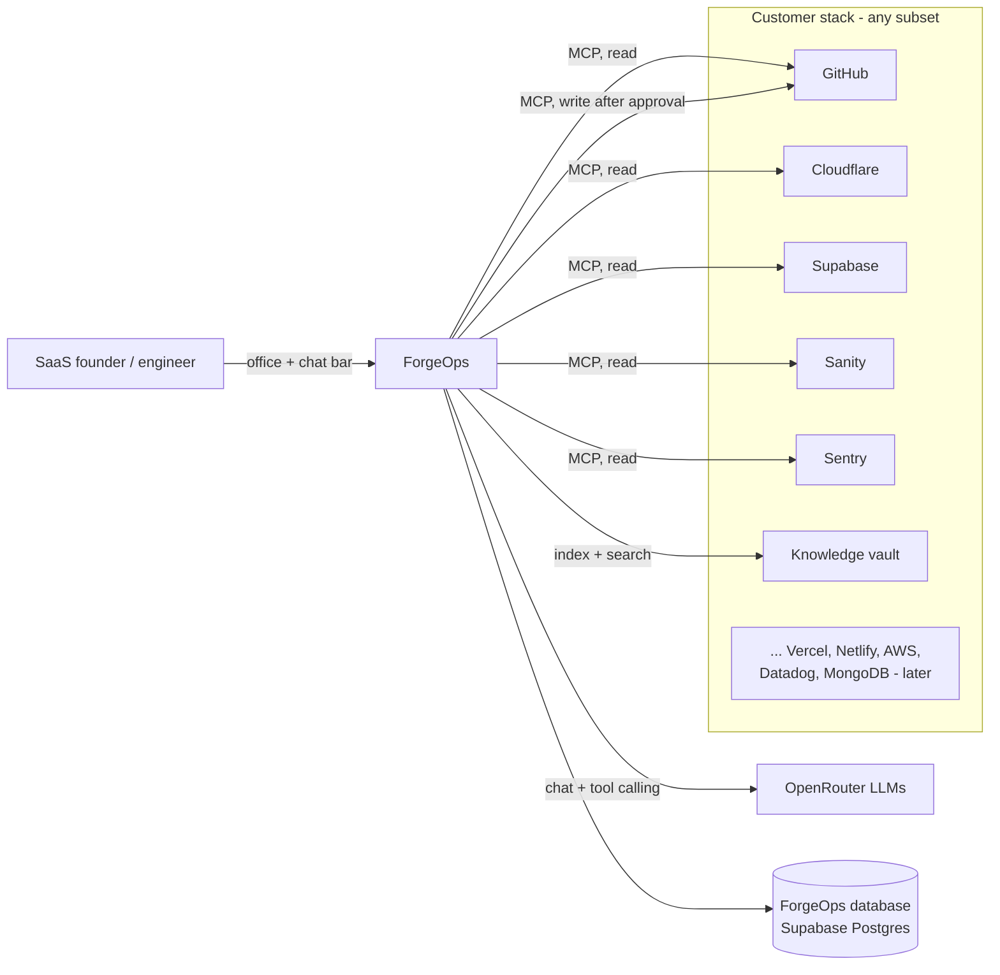
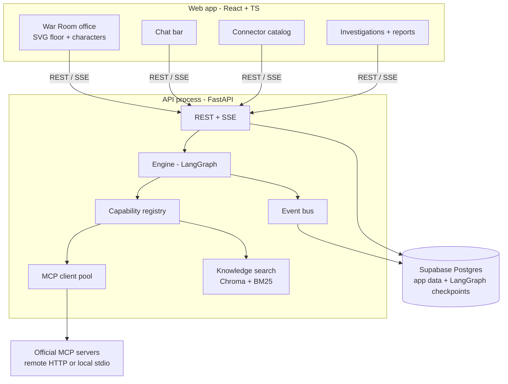
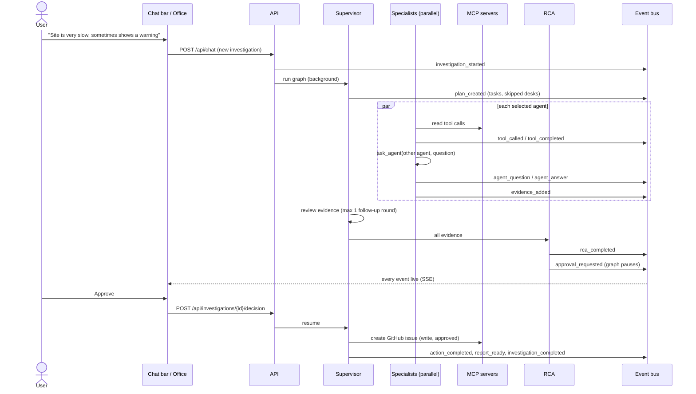
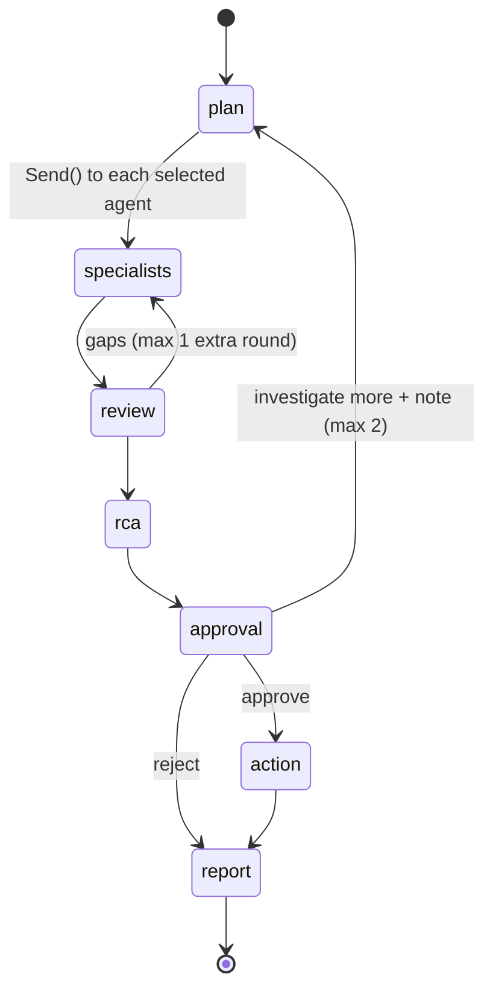
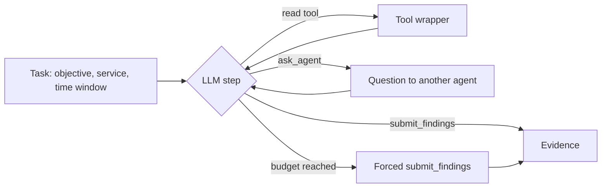
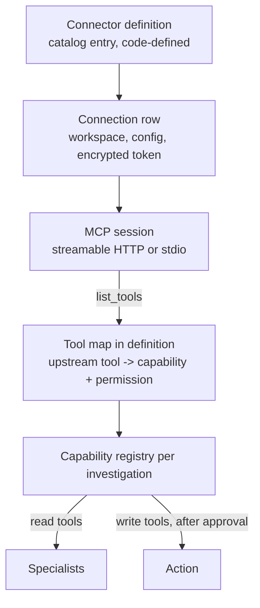
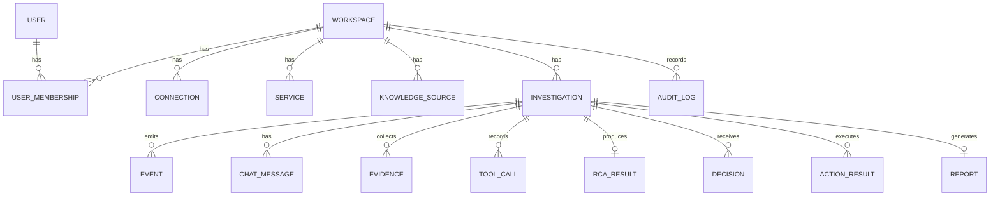

# ForgeOps — Technical Requirements Document (MVP)

| | |
|---|---|
| Document | TRD v2, MVP scope |
| Status | Draft for review |
| Date | 2026-09-21 |
| Companion | [PRD.md](PRD.md) |

> v2 replaces v1: area-based agents, MCP connector catalog with capability routing, agent-to-agent questions, chat bar, Supabase-hosted ForgeOps database, real-website testing. Already built in M0 and kept: auth, workspaces, investigations API, persisted event bus with SSE replay, React shell.

---

## 1. Architecture overview

### 1.1 System context



### 1.2 Runtime components



The engine runs inside the API process as background asyncio tasks (MVP). Docker is optional for development: ForgeOps' own database is a Supabase project, and remote MCP servers need no containers.

### 1.3 Layers

| Layer | Responsibility | Package |
|---|---|---|
| Presentation | Office, chat bar, catalog, history | `frontend/` |
| Application | Auth, REST, SSE, chat, lifecycle | `backend/forgeops/api` |
| Orchestration | LangGraph graph, shared state, checkpoints, agent messaging | `backend/forgeops/engine` |
| Agents | Supervisor, 6 specialists, RCA, Action | `backend/forgeops/engine/agents` |
| Capability | Tool spec, registry, policy, wrapper | `backend/forgeops/capabilities` |
| Connectors | Catalog definitions, MCP client, native knowledge connector | `backend/forgeops/connectors` |
| Knowledge | Ingest, chunk, embed, BM25, hybrid retrieval | `backend/forgeops/knowledge` |
| Persistence | Models, migrations | `backend/forgeops/db`, `backend/alembic` |
| Events | Bus, persistence, SSE | `backend/forgeops/events` |

## 2. Technology choices

| Concern | Choice |
|---|---|
| Backend | Python 3.12 (uv), FastAPI, Pydantic v2, SQLAlchemy 2 async + asyncpg, Alembic |
| Orchestration | LangGraph 1.2 (`StateGraph`, `Send`, `interrupt`, `Command`) + `langgraph-checkpoint-postgres` (`AsyncPostgresSaver`) |
| LLM | OpenRouter through `langchain-openai` `ChatOpenAI(base_url="https://openrouter.ai/api/v1")`; model per role from config |
| MCP | Official `mcp` Python SDK client; transports: streamable HTTP (remote servers) and stdio (local `npx` servers) |
| Knowledge | ChromaDB (embedded, persistent directory), local embeddings, `rank-bm25` |
| ForgeOps database | Supabase Postgres (session pooler or direct connection; not the transaction pooler, which breaks asyncpg prepared statements) |
| Frontend | React 19, TypeScript, Vite, React Router 8, TanStack Query; office drawn with SVG + CSS |
| Tests | pytest + pytest-asyncio + httpx; Vitest + Testing Library |

## 3. Agents

### 3.1 Roles

| Agent id | Role | Tools |
|---|---|---|
| `supervisor` | Plan, assign, review, answer chat follow-ups | none (reads registry, service map, evidence) |
| `code` | What changed in code | capability `code` |
| `frontend_hosting` | Deploys, builds, edge, domains | capability `hosting` |
| `backend_services` | APIs, functions, auth, CMS | capabilities `backend`, `content` |
| `database` | Queries, connections, schema | capability `database` |
| `observability` | Errors, logs, metrics, traces | capabilities `errors`, `logs`, `metrics` |
| `knowledge` | Runbooks, docs, past incidents | capability `knowledge` |
| `rca` | Root cause, failure point, confidence | none (reads evidence) |
| `action` | Approved writes | `write` tools of approved recommendations only |

Every specialist also gets the `ask_agent` tool (§5) and the `submit_findings` tool.

### 3.2 Capabilities

`code, hosting, backend, content, database, errors, logs, metrics, knowledge` (read) and `write` (issue creation etc.). A capability is routed to exactly one agent (table above); a connector may provide several capabilities.

## 4. Investigation flow

### 4.1 Sequence



### 4.2 Graph



- `plan` selects agents whose capabilities are connected and relevant; the rest are emitted as `agent_skipped` with a reason.
- `specialists` is one node type invoked via `Send("specialist", AgentTask)` per selected agent; LangGraph runs them concurrently.
- State lists written by parallel agents use reducers (`Annotated[list[T], operator.add]`).
- `approval` calls `interrupt(payload)`; `AsyncPostgresSaver` persists the pause; `POST /decision` resumes with `Command(resume=decision)`.

### 4.3 Specialist loop



Budgets per specialist: 8 tool calls, 2 `ask_agent` questions, 150 s wall clock, 20 s per tool call. Per investigation: 12 questions total, 20 minutes total.

## 5. Agent-to-agent questions

- Tool: `ask_agent(agent: AgentId, question: str) -> str`, available to specialists.
- Handling: the engine runs a **focused sub-run** of the target agent: its system prompt, its read tools, the question as the task, a budget of 3 tool calls and 45 s, and **no** `ask_agent` tool (no nested questions, no loops). The answer text returns to the asking agent. Any evidence the target finds is added to shared state with `agent = target`.
- If the target agent has no connectors, the answer is "no connector for this area" immediately.
- Events: `agent_question {from, to, question}` then `agent_answer {from, to, answer_summary}` (or `agent_question_failed`). The office uses these for the walk to the other desk and back.
- Limits: 2 questions per agent per round, 12 per investigation; repeated identical questions return the cached answer.

## 6. Data contracts

### 6.1 Shared state

```python
class InvestigationState(TypedDict):
    workspace_id: str
    investigation_id: str
    incident: Incident                 # text, source (chat|web), service_id?, window?
    capabilities: dict[str, list[str]] # agent -> connected capabilities at start
    plan: Plan | None
    evidence: Annotated[list[Evidence], operator.add]
    tool_calls: Annotated[list[ToolCallRecord], operator.add]
    questions: Annotated[list[AgentQuestion], operator.add]
    review_rounds: int
    rca: RCA | None
    decision: Decision | None
    action_results: Annotated[list[ActionResult], operator.add]
    errors: Annotated[list[AgentError], operator.add]
    warnings: Annotated[list[str], operator.add]
```

### 6.2 Evidence

```python
class Artifact(BaseModel):
    type: Literal["commit","pull_request","diff","deployment","build_log","workflow_run",
                  "error_issue","error_event","log_lines","metric","query_stats",
                  "db_advisor","content_change","config","doc_chunk"]
    ref: str                  # sha, deploy id, issue id, query, document id, path
    url: str | None
    timestamp: datetime | None
    excerpt: str | None       # max 2 KB

class Evidence(BaseModel):
    id: str
    agent: AgentId
    capability: Capability
    connector: str            # connection id
    connector_type: str       # github | cloudflare | supabase | sanity | sentry | knowledge
    finding: str              # one-sentence claim
    failure_point: str | None # e.g. "src/pages/checkout.tsx:42", "deploy 3f2a…", "orders_by_user query"
    artifacts: list[Artifact]
    severity: Literal["info","low","medium","high","critical"]
    confidence: float
    limitations: str | None
    tool_call_ids: list[str]  # non-empty
```

### 6.3 RCA

```python
class Recommendation(BaseModel):
    id: str
    title: str
    description: str
    action: Literal["none", "github_issue"]
    parameters: dict           # shown verbatim to the approver
    requires_approval: bool

class RCA(BaseModel):
    summary: str               # plain-language root cause
    failure_point: str         # the exact place it breaks
    category: Literal["code_change","config_change","deployment","content_change",
                      "database","dependency","infrastructure","traffic","unknown"]
    confidence: float
    timeline: list[TimelineItem]           # ordered events with evidence ids
    supporting_evidence: list[str]
    contradicting_evidence: list[str]
    alternative_hypotheses: list[str]
    missing_information: list[str]         # e.g. "No error tracker connected"
    recommendations: list[Recommendation]
```

Confidence caps (in code): no supporting evidence → ≤ 0.2; one connector type only → ≤ 0.6; any contradicting evidence → −0.1.

## 7. Connectors and MCP

### 7.1 Model



### 7.2 Connector definition (code)

```python
class ToolMapping(BaseModel):
    upstream: str                # tool name exposed by the MCP server
    name: str                    # ForgeOps name, e.g. "supabase.get_logs"
    capability: Capability
    permission: Literal["read", "write"]

class ConnectorDefinition(BaseModel):
    type: str                    # "github", "cloudflare", ...
    display_name: str
    category_agents: list[AgentId]   # desks it shows under in the catalog
    status: Literal["available", "coming_soon"]
    transport: Literal["http", "stdio", "native"]
    endpoint: str | None         # remote MCP URL, or stdio command template
    config_fields: list[ConfigField]   # e.g. token (secret), account_id, project_ref
    tools: list[ToolMapping]     # allowlist; unmapped upstream tools are never exposed
    docs_url: str
```

- **Allowlist, not trust.** Only tools listed in `tools` are ever given to an agent. New upstream tools are ignored until mapped.
- **Read-only modes** are enabled wherever the server offers one (e.g. GitHub `--read-only`/read-only toolsets, Supabase `--read-only`).
- Each definition's exact upstream tool names, transport and auth header are verified against the pinned server version when that connector is built, and captured in a contract test. If a server cannot authenticate with an API token, that connector falls back to a native HTTP client implementing the same `ToolMapping` names.

### 7.3 MVP connectors

| Connector | Server | Auth for MVP | Capabilities | Example tools (ForgeOps names) |
|---|---|---|---|---|
| GitHub | Official GitHub MCP server | Fine-grained PAT | code, hosting (Actions), write | `github.list_commits`, `github.get_commit`, `github.compare`, `github.list_pull_requests`, `github.get_file`, `github.list_workflow_runs`, `github.get_job_logs`, `github.create_issue` (write) |
| Cloudflare | Official Cloudflare MCP servers (builds, observability, workers) | API token + account ID | hosting, backend, logs, metrics | `cloudflare.list_deployments`, `cloudflare.get_build_logs`, `cloudflare.query_worker_logs`, `cloudflare.traffic_analytics` |
| Supabase | Official Supabase MCP server, read-only | Personal access token + project ref | database, backend, logs | `supabase.get_logs(service)`, `supabase.list_migrations`, `supabase.get_advisors`, `supabase.execute_readonly_sql`, `supabase.list_edge_functions` |
| Sanity | Official Sanity MCP server | Read token + project ID + dataset | content | `sanity.recent_changes`, `sanity.get_document`, `sanity.query` |
| Sentry | Official Sentry MCP server | Auth token + org | errors | `sentry.list_issues`, `sentry.get_issue_details`, `sentry.list_releases` |
| Knowledge vault | Native | Folder path or repo path | knowledge | `knowledge.search` |

### 7.4 Tool wrapper
- Timeout 20 s; 2 retries on rate limit / 5xx with backoff.
- Truncates results (logs ≤ 200 lines, text ≤ 8 KB, lists ≤ 50 items) and records `truncated`.
- Emits `tool_called` / `tool_completed`; stores a `ToolCallRecord` for provenance.
- Wraps output as untrusted data for the LLM.
- Never logs or emits secrets.

### 7.5 Service map

```python
class Service(BaseModel):
    id: str
    workspace_id: str
    name: str                 # "marketing site", "api"
    aliases: list[str]
    resources: dict[str, str] # connector type -> resource id
                              # e.g. {"github": "owner/repo", "cloudflare": "pages:my-site",
                              #       "supabase": "abcd1234", "sanity": "proj/production",
                              #       "sentry": "my-org/web"}
```

## 8. Chat

- `POST /api/chat` with `{text, investigation_id?}`.
  - Without `investigation_id`: creates an investigation from the text and starts the graph.
  - With `investigation_id` while running: stored as user context, passed to the Supervisor at its next review.
  - With `investigation_id` after RCA: a follow-up question. The Supervisor answers from evidence; if it needs new data it starts an "investigate more" round.
- Chat messages are persisted (`chat_messages` table) and also emitted as `chat_message` events, so the chat and the office replay together.

## 9. Events

Existing (M0): `investigation_started, supervisor_started, plan_created, agent_skipped, agent_started, tool_called, tool_completed, evidence_added, agent_failed, agent_completed, review_completed, rca_started, rca_completed, approval_requested, approval_granted, approval_rejected, action_started, action_completed, report_ready, investigation_completed, investigation_failed`.

Added in v2: `agent_question`, `agent_answer`, `agent_question_failed`, `chat_message`.

Envelope unchanged: `{seq, investigation_id, type, agent, ts, data}`; SSE with `Last-Event-ID` replay.

## 10. Persistence



- Existing from M0: workspaces, users, memberships, auth_sessions, investigations, events, audit_log.
- `connection.secret_encrypted`: Fernet-encrypted JSON.
- LangGraph checkpoint tables created by `AsyncPostgresSaver.setup()`.
- `investigation.status`: `queued | running | awaiting_approval | acting | completed | rejected | failed`.

## 11. API

| Method | Path | Purpose |
|---|---|---|
| POST | `/auth/login`, `/auth/logout`; GET `/auth/me` | Session (built) |
| GET | `/health` | Liveness (built) |
| GET | `/connectors/catalog` | Definitions grouped by agent, with status and config fields |
| GET/POST | `/connections` | List / connect (validates, lists tools) |
| GET/DELETE | `/connections/{id}`; POST `/connections/{id}/test` | Detail (no secrets), remove, re-test |
| GET | `/agents` | Agents with their connected capabilities (for desks) |
| GET/POST/PATCH/DELETE | `/services…` | Service map |
| POST | `/chat` | New investigation or message (§8) |
| GET | `/investigations`, `/investigations/{id}` | List / snapshot (built; snapshot extended) |
| GET | `/investigations/{id}/events` | SSE (built) |
| POST | `/investigations/{id}/decision` | Approve / reject / investigate more |
| GET | `/investigations/{id}/report` | Markdown report |
| GET/POST | `/knowledge/sources`, POST `/knowledge/sources/{id}/reindex` | Vault |
| GET | `/audit` | Audit log |

## 12. War Room UI

### 12.1 Layout

```text
┌──────────────── INCIDENT SCREEN: title · status · timer ─────────────────┬──── CHAT ────┐
│                                                                           │ You: site is │
│  ┌ Supervisor ┐        ┌──────── EVIDENCE WALL ────────┐   ┌ RCA ┐        │ slow…        │
│  │ whiteboard │        │ pinned cards                   │   │board│        │ Supervisor:  │
│  └────────────┘        └────────────────────────────────┘   └─────┘        │ plan: 4 desks│
│                                                                           │ …            │
│  [Code]   [Frontend & Hosting]   [Backend & Services]   [Database]        │ RCA ready ▸  │
│                                                                           │ [Approve]    │
│  [Observability]   [Knowledge]                            [Action]        │ [Reject]     │
│                                                                           │ ┌──────────┐ │
│                                                                           │ │ message  │ │
└───────────────────────────────────────────────────────────────────────────┴─┴──────────┴─┘
```

- One SVG floor plan (fixed viewBox, scales to width). On narrow screens the chat moves below the office.
- Characters: top-down figures with role colour and name tag; desk shows connector logos or "no connector".
- Motion: CSS transforms on SVG groups along precomputed aisle paths between desks; `prefers-reduced-motion` switches to instant moves.

### 12.2 Event → office

| Event | Office |
|---|---|
| `investigation_started` | Incident screen shows the problem; alarm light on |
| `plan_created` | Supervisor writes the plan on the whiteboard; task cards go to chosen desks; skipped desks show reason |
| `agent_started` | Agent sits, monitor on |
| `tool_called` / `tool_completed` | Typing; speech bubble with connector + summary; ✓/✗ on monitor |
| `agent_question` | Asking agent walks to the target desk; bubble with the question |
| `agent_answer` | Target answers in a bubble; asker walks back |
| `evidence_added` | Agent pins a card on the evidence wall |
| `agent_failed` | Red marker over desk |
| `rca_started` / `rca_completed` | RCA analyst gathers cards; root cause written on the board; chat shows the RCA |
| `approval_requested` | Chat shows Approve / Reject / Investigate more |
| `action_*` | Action agent carries the issue out the "GitHub" door; link appears |
| `investigation_completed` | Alarm off; "Report ready" |

### 12.3 State
A pure reducer `(OfficeState, Event) → OfficeState` drives the office, the chat and the evidence wall from one event stream (built in M0 as `applyEvent` / `useEventStream`). Walking animations are derived from state transitions, so a replay produces the same picture.

## 13. Security

| Area | Requirement |
|---|---|
| Credentials | Connection tokens Fernet-encrypted in the DB; never returned, logged, emitted or put in prompts |
| Least privilege | Per-connector tool allowlist; investigating agents get only `read` tools; MCP read-only modes on; write session opened only in the Action node after a stored approval |
| Approval integrity | Action executes only the approved recommendation ids, with the stored parameters |
| Prompt injection | Tool output wrapped as untrusted data; no write tools reachable while investigating |
| MCP servers | Official servers only, pinned versions; stdio servers run with only their own token in the environment |
| Auth | Argon2id, httpOnly session cookie, CSRF header, login rate limit (built) |
| Tenancy | `workspace_id` on every row and query (built) |
| Audit | Decisions and writes recorded |

## 14. Error handling

| Failure | Behavior |
|---|---|
| Connection fails its test at start | Its capabilities excluded; listed in `missing_information` |
| Tool timeout / error | Retry ×2, then failed result the agent can reason about |
| Agent exception | `agent_failed`; investigation continues |
| `ask_agent` target fails or has no connector | `agent_question_failed` with reason; asker continues |
| Invalid structured LLM output | One repair retry, then agent fails |
| RCA failure | `investigation_failed`; evidence stays visible; partial report |
| Server restart while awaiting approval | Resumes from checkpoint |
| Server restart mid-run | Marked failed on startup with reason |
| Budget reached | Agent forced to submit findings; RCA notes the limit |

## 15. Testing

| Level | What |
|---|---|
| Unit | Models, confidence caps, truncation, allowlist/policy, capability routing, reducers |
| Connector contract | Each connector's tool mapping against recorded real responses (test fixtures only) |
| Engine | Full graph with a scripted fake LLM and fake connectors: parallelism, `ask_agent` limits, partial connectors, failures, interrupt/resume |
| API | Chat, decision, catalog, connections, SSE |
| Frontend | Office reducer from event logs, chat, catalog |
| Real-world | Test scenarios on previews of the owner's website (PRD §10), results recorded in `docs/evaluation.md` |

Runtime code never contains mock or fallback data. Fakes live only in tests.

## 16. Configuration

```text
FORGEOPS_ENV, FORGEOPS_SECRET_KEY, FORGEOPS_ADMIN_EMAIL, FORGEOPS_ADMIN_PASSWORD, FORGEOPS_WORKSPACE_NAME
DATABASE_URL                 # Supabase Postgres (session pooler or direct), postgresql+asyncpg://…
OPENROUTER_API_KEY
FORGEOPS_MODEL_SUPERVISOR, FORGEOPS_MODEL_SPECIALIST, FORGEOPS_MODEL_RCA
KNOWLEDGE_DATA_DIR           # local folder for the Chroma index
```

Connector tokens are entered in the Connectors page, not in `.env`.

## 17. Milestones

| # | Milestone | Delivers | Owner can test |
|---|---|---|---|
| M0 ✅ | Foundation | Auth, workspaces, investigations, event bus + SSE, React shell | Done |
| M0.5 | Supabase database | ForgeOps' own data in Supabase; Docker optional; `.env`/README updated | Runs without Docker |
| M1 | Engine core | Capability registry, MCP client layer, LLM client, graph with Supervisor, specialists, `ask_agent`, RCA, approval pause, report; Knowledge vault connector | Chat an incident about the docs in the vault; see real plan, agents, RCA via events |
| M2 | War Room + chat | Office floor, characters, walking, evidence wall, RCA board, chat bar with approval buttons | Watch M1 investigations in the office |
| M3 | Catalog + GitHub + Sentry | Connector catalog UI, connect/test flow, service map; GitHub and Sentry connectors | Test 1 (frontend JS error on a preview) |
| M4 | Cloudflare + Supabase + Sanity | Three connectors | Tests 2–4 |
| M5 | Actions + hardening | GitHub issue on approval, audit log, budgets tuning, evaluation write-up | Test 5 + full release definition |

Post-MVP: Vercel, Netlify, GitLab, Firebase, MongoDB, Datadog, Prometheus, AWS, Notion, Jira, Slack connectors; OAuth connect flows; sign-up and multiple workspaces; hosting ForgeOps.
