# EOPS System Architecture & Flow Deep-Dive

EOPS represents a shift from static alert monitoring to autonomous multi-agent incident troubleshooting. By decoupling agent reasoning from tool execution, and linking them via a unified **Shared Investigation State**, the platform achieves parallel telemetry collection and deterministic synthesis.

---

## 🛠️ Unified State Schema

The entire workflow relies on updating a shared memory state, rather than direct inter-agent messaging. The schema is defined as:

```python
class InvestigationState(TypedDict):
    incident_description: str
    investigation_plan: Dict[str, Any]
    active_agents: List[str]
    github: GithubFindings
    logs: LogFindings
    knowledge: KnowledgeFindings
    root_cause: RootCauseAnalysis
    approval_status: str  # "pending", "approved", "rejected"
    human_feedback: Optional[str]
    current_step: str
    logs_trace: List[str]
```

### Benefits of State-Sharing:
1. **Concurrency:** Sub-agents (`GitHubAgent`, `LogsAgent`, `KnowledgeAgent`) do not block each other; they read the state's `incident_description` and write exclusively to their assigned findings fields.
2. **Observability:** Storing trace entries in `logs_trace` allows the frontend UI to display step-by-step progress and agent timelines.
3. **Decoupled Synthesis:** The `RootCauseAgent` is triggered only after all parallel nodes complete, allowing it to inspect all telemetry concurrently to formulate its hypothesis.

---

## 🔄 Agentic Orchestration Cycle

```mermaid
sequenceDiagram
    autonumber
    actor Engineer as Engineer Dashboard
    participant API as FastAPI Backend
    participant Supervisor as Supervisor Agent
    participant Parallel as Sub-Agents (Parallel)
    participant RCA as Root Cause Agent
    participant DB as Vector Store & Logs

    Engineer->>API: POST /api/investigate (Incident description)
    API->>Supervisor: Initialize State & Run Planning
    Note over Supervisor: Determine needed agents<br/>(GitHub, Logs, RAG)
    Supervisor-->>API: Return plan & Active agent list
    API->>Parallel: Dispatch ThreadPool (GitHub/Logs/RAG)
    Parallel->>DB: Query API keys, logs & ChromaDB docs
    DB-->>Parallel: Return raw logs, git commits, & runbooks
    Parallel-->>API: Write findings back to Shared State
    API->>RCA: Execute RCA Synthesis
    Note over RCA: Analyze telemetry to find root cause
    RCA-->>API: Return probable cause, evidence list & remediation steps
    API-->>Engineer: Render findings and await Approval
    
    rect rgb(20, 30, 50)
        Note over Engineer, API: Human-in-the-Loop Gateway
        Engineer->>API: POST /api/approve (User Decision)
        alt Approved
            API->>API: Generate Markdown report in /reports/
        else Rejected / Needs Info
            API->>API: Mark status as rejected, logs feedback, rolls state
        end
    end
    API-->>Engineer: Update dashboard UI
```



---

## 🧩 Extensibility Model (AI OS Design)

Adding a new agent (e.g., a **Deployment Agent** or **Cloud Metrics Agent**) to EOPS requires only three simple steps:

1. **Add findings key in State:** Add a new TypedDict key in `memory/state.py` (e.g., `metrics: MetricsFindings`).
2. **Create the Tool & Agent:** Define the tool in `tools/metrics/` and the agent in `agents/metrics/`.
3. **Update Supervisor Planner:** Add rules or prompts in `agents/supervisor/agent.py` to activate the agent when metric indicators are detected.

Because the orchestration graph is built using state compilation rather than hardcoded sequences, the system scales smoothly as your engineering automation needs grow.
