# ForgeOps / EOPS — Canonical Architecture Diagrams

**Implementation status: NOT STARTED.** These diagrams describe the target architecture that Claude Code should build.

---

# 1. System context

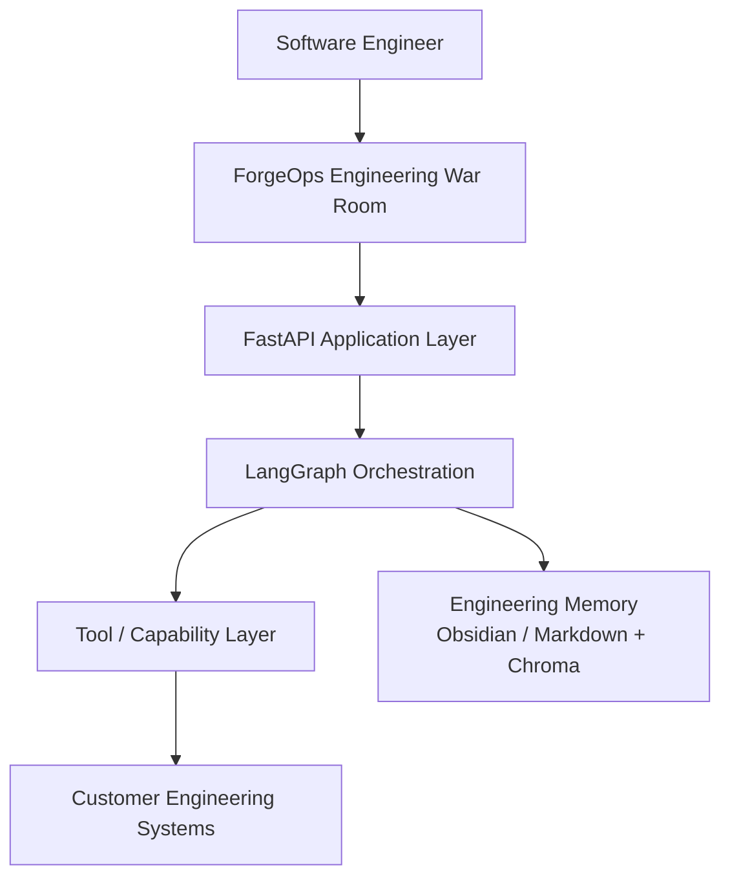

---

# 2. Layered architecture

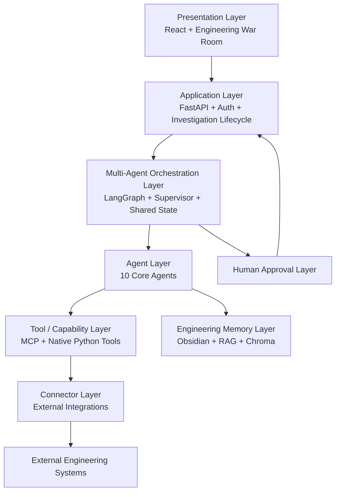

---

# 3. Ten-agent architecture

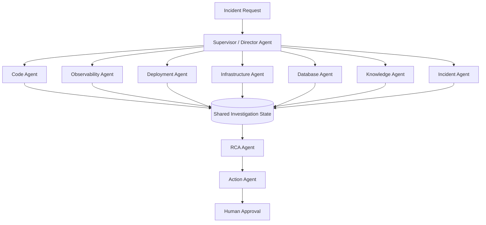

---

# 4. Parallel investigation

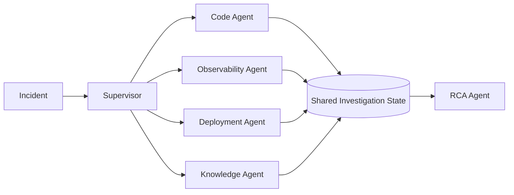

Independent specialist investigations should execute concurrently.

---

# 5. Agent-to-capability model

```mermaid
flowchart TB

    CODE[Code Agent]
    OBS[Observability Agent]
    DEP[Deployment Agent]
    INFRA[Infrastructure Agent]
    DB[Database Agent]
    KNOW[Knowledge Agent]
    INC[Incident Agent]
    ACTION[Action Agent]

    GH[GitHub]
    GL[GitLab]
    BB[Bitbucket]

    PROM[Prometheus]
    GRAF[Grafana]
    LOKI[Loki]
    TEMPO[Tempo / Jaeger]
    DD[Datadog]

    GHA[GitHub Actions]
    JEN[Jenkins]
    ARGO[Argo CD]

    K8S[Kubernetes]
    DOCKER[Docker]
    CLOUD[AWS / Azure / GCP]

    PG[PostgreSQL]
    MYSQL[MySQL]
    MONGO[MongoDB]
    REDIS[Redis]

    JIRA[Jira]
    PD[PagerDuty]
    SLACK[Slack]
    SNOW[ServiceNow]

    CODE --> GH
    CODE --> GL
    CODE --> BB

    OBS --> PROM
    OBS --> GRAF
    OBS --> LOKI
    OBS --> TEMPO
    OBS --> DD

    DEP --> GHA
    DEP --> JEN
    DEP --> ARGO

    INFRA --> K8S
    INFRA --> DOCKER
    INFRA --> CLOUD

    DB --> PG
    DB --> MYSQL
    DB --> MONGO
    DB --> REDIS

    INC --> JIRA
    INC --> PD
    INC --> SLACK
    INC --> SNOW

    ACTION --> JIRA
    ACTION --> GHA
    ACTION --> K8S
```

The agent count stays fixed while customer connectors vary.

---

# 6. MCP integration

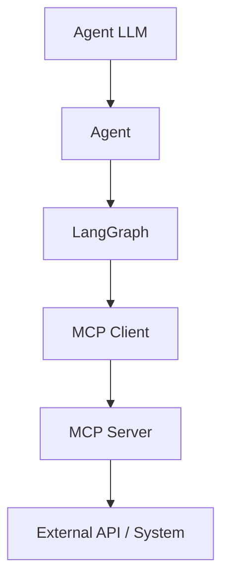

Example:

```text
Code Agent
 → MCP Client
 → GitHub MCP
 → GitHub

Observability Agent
 → MCP Client
 → Prometheus MCP
 → Prometheus

Incident Agent
 → MCP Client
 → Jira MCP
 → Jira
```

MCP is connectivity, not orchestration.

---

# 7. Native internal tool path

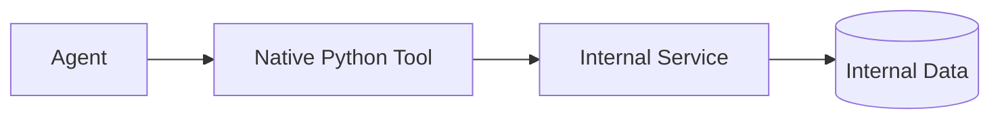

Suitable internal components:
- RAG retrieval;
- Chroma;
- BM25;
- Markdown parsing;
- log parsing;
- evidence normalization;
- report generation;
- shared state utilities.

---

# 8. Capability registry

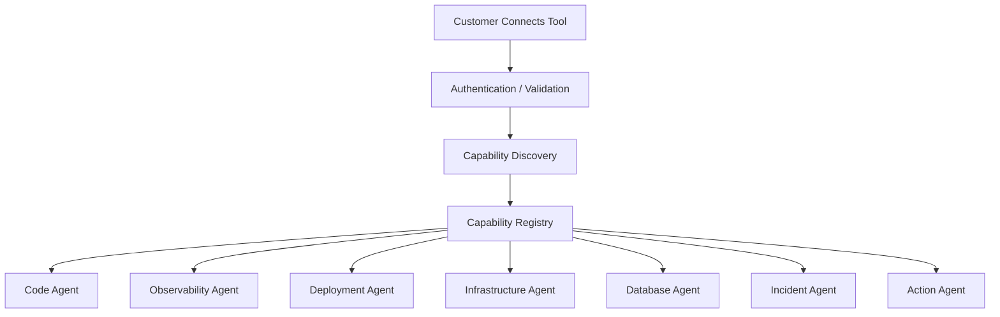

Example mapping:

```text
GitHub:
  read_commits        → Code Agent
  read_pull_requests  → Code Agent
  read_files          → Code Agent
  read_issues         → Incident Agent
  read_actions        → Deployment Agent
```

---

# 9. Customer connection onboarding

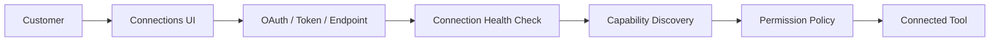

Customers configure tools, not agents.

---

# 10. Permission architecture

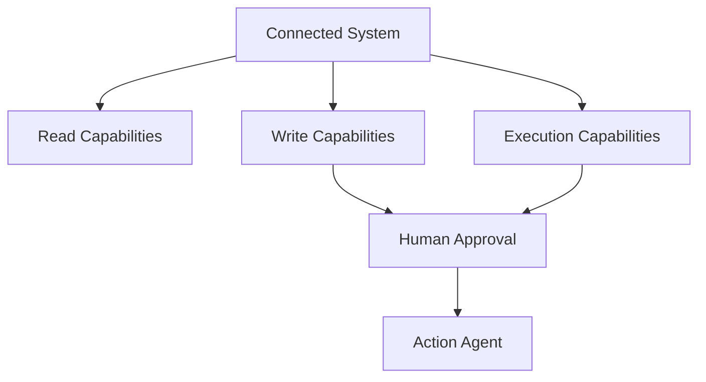

Defaults:

```text
READ    = available when needed
WRITE   = disabled
EXECUTE = disabled
```

---

# 11. Human approval

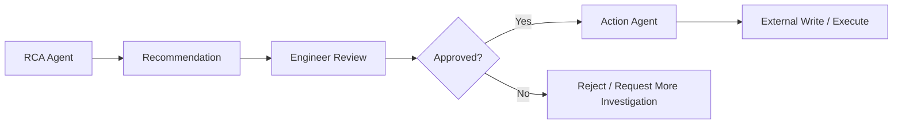

---

# 12. Engineering memory

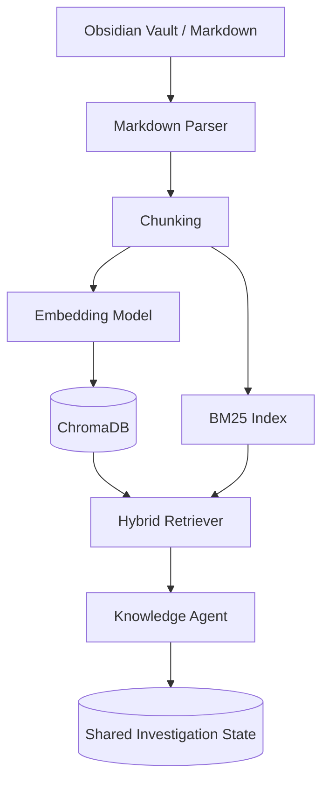

---

# 13. Real-time War Room events

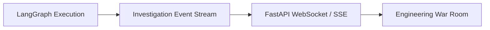

Canonical events:

```text
investigation_started
supervisor_started
agent_started
tool_called
tool_completed
evidence_added
agent_failed
agent_completed
rca_started
rca_completed
approval_requested
approval_granted
approval_rejected
action_started
action_completed
investigation_completed
```

---

# 14. War Room visual layout

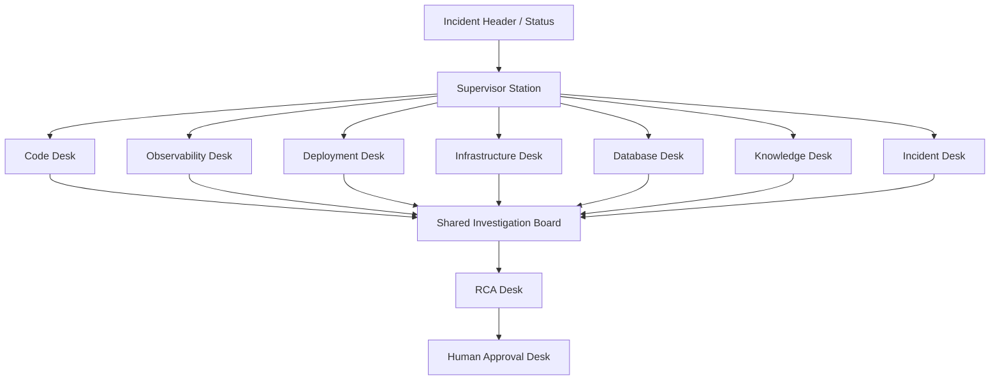

The War Room should resemble a modern engineering office:
- desks/stations;
- shared evidence wall;
- live status;
- subtle motion;
- clear state indicators.

All motion should be driven by actual backend events.

---

# 15. End-to-end target architecture

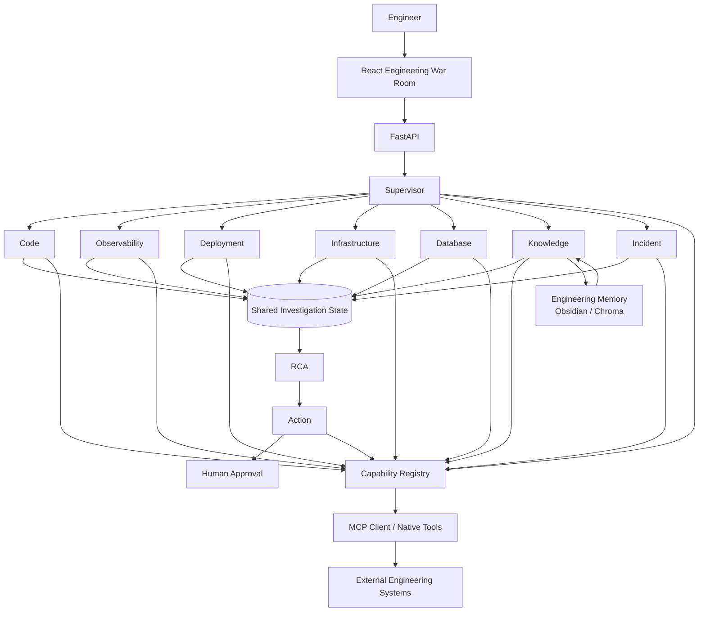

---

# 16. Runtime mental model

```text
LLM
 ↓
Agent
 ↓
LangGraph
 ↓
Tool interface
 ↓
MCP Client OR Native Python Tool
 ↓
Connector
 ↓
External Engineering System
```

Globally:

```text
10 Core Agents
      +
Dynamic Connectors
      +
Capability Registry
      +
Least-Privilege Permissions
      +
Shared Investigation State
      +
Human Approval
```

---

# 17. Explicit non-requirement

Do not add Munder Difflin or another external agentic harness as a required runtime layer.

Use:

```text
LangGraph = orchestration
MCP/native tools = tool connectivity
FastAPI = application/backend
React = War Room UI
```

A dedicated harness/runtime can be considered later for:
- observability;
- execution control;
- evaluation;
- cost tracking;
- retries/timeouts;
- sandboxing.

It is not part of the required first implementation.
